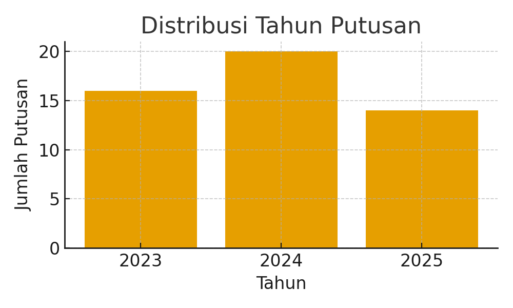
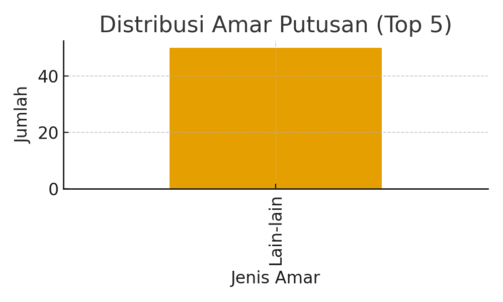

# ⚖️ Dataset Putusan Pengadilan Narkotika — PN AMLAPURA (2025)

Repositori ini berisi **50 dokumen putusan pengadilan** dari **Pengadilan Negeri Amlapura (PN AMLAPURA)** terkait tindak pidana **Narkotika dan Psikotropika**.  
Dataset dikumpulkan manual dari **Direktori Putusan Mahkamah Agung RI** sebagai bagian dari tugas mata kuliah **Temu Kembali Informasi (Information Retrieval)** semester Ganjil 2025/2026.

---

## 🎯 Tujuan Dataset

Dataset ini bertujuan menyediakan **data hukum terstruktur dan terbuka** untuk keperluan:
- Eksperimen preprocessing dan indexing teks hukum  
- Pengembangan sistem **Temu Kembali Informasi (IR)**  
- Penerapan model pencarian berbasis TF-IDF, BM25, atau Transformer  
- Analisis pola dan isi putusan pengadilan

---

## 📊 Statistik Dataset

### Distribusi Tahun Putusan

### Distribusi Amar Putusan (Top 5)

---

## 🗂️ Deskripsi File `Overview.xlsx`

File `Overview.xlsx` berisi metadata setiap dokumen putusan.

| Kolom | Deskripsi |
|-------|------------|
| **No** | Nomor urut data |
| **No Putusan** | Nomor perkara dalam format resmi PN |
| **Lembaga Peradilan** | Nama pengadilan (mis. PN Amlapura) |
| **Barang Bukti** | Barang bukti yang disebut dalam perkara |
| **Amar Putusan** | Ringkasan hasil akhir/vonis hakim |
| **Detail URL** | Tautan halaman detail di situs MA RI |
| **PDF URL** | Tautan langsung ke file PDF putusan |
| **Status** | Status hukum (jika tersedia) |
| **Tahun** | Tahun dikeluarkannya putusan |

📘 *Contoh entri (5 data pertama)*  
| No | No Putusan | Lembaga | Amar Putusan | Tahun |
|----|-------------|----------|---------------|--------|
| 1 | 51/Pid.Sus/2025/PN Amp | PN AMLAPURA | Lain-lain | 2025 |
| 2 | 46/Pid.Sus/2025/PN Amp | PN AMLAPURA | Lain-lain | 2025 |
| 3 | 47/Pid.Sus/2025/PN Amp | PN AMLAPURA | Lain-lain | 2025 |
| 4 | 44/Pid.Sus/2025/PN Amp | PN AMLAPURA | Lain-lain | 2025 |
| 5 | 25/Pid.Sus/2025/PN Amp | PN AMLAPURA | Lain-lain | 2025 |

---

## 🔍 Sumber Data

> **Direktori Putusan Mahkamah Agung Republik Indonesia**  
> [https://putusan3.mahkamahagung.go.id/direktori.html](https://putusan3.mahkamahagung.go.id/direktori.html)

Contoh:
- [51/Pid.Sus/2025/PN Amp](https://putusan3.mahkamahagung.go.id/direktori/putusan/xyz)
- [46/Pid.Sus/2025/PN Amp](https://putusan3.mahkamahagung.go.id/direktori/putusan/xyz)

---

## 👥 Anggota Kelompok

| Nama | NIM | Peran |
|------|-----|-------|
| Dio Richard Prastiyo | 202110370001 | Pengumpulan & Preprocessing Data |
| [Nama Anggota 2] | [NIM Anggota 2] | Dokumentasi & Metadata |

---

## ⚖️ Lisensi

Semua dokumen bersumber dari situs publik **Mahkamah Agung RI** dan **tidak terikat HaKI**.  
Dataset ini dapat digunakan bebas untuk **riset, pembelajaran, dan proyek akademik**, dengan mencantumkan sumber aslinya.

---

## 🧠 Penggunaan Lanjutan

Dataset ini akan digunakan pada **Tugas 3 (Preprocessing & Indexing)** untuk membangun sistem pencarian dokumen hukum berbasis teks menggunakan tahapan:
1. Case Folding → Tokenisasi → Stopword Removal → Stemming  
2. Pembobotan TF-IDF / BM25  
3. Indexing dan Query Retrieval  

---

📅 **Dibuat:** November 2025  
🏛️ **Program Studi Informatika — Universitas Muhammadiyah Malang**  
✍️ **Dosen Pengampu:** Ir. Galih Wasis Wicaksono, S.Kom., M.Cs.

